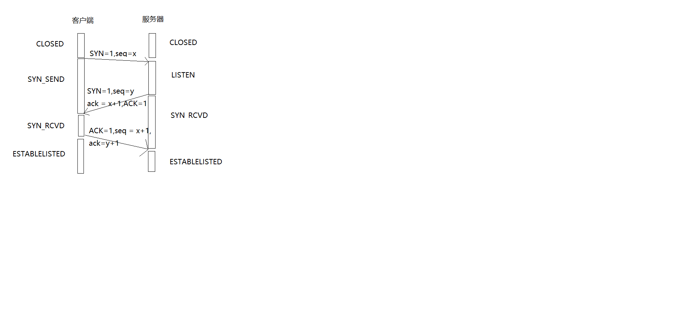
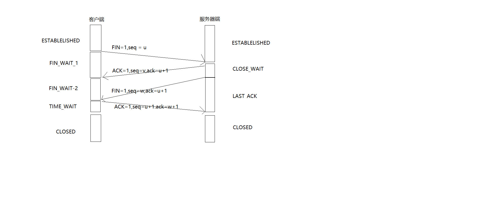

记录一些知识点，就是比较杂  
## 目录 ##
* [计算机网络](#network)   
  * [传输层](#transport)
    * [TCP](#TCP) 

# 计算机网络 #
## 传输层 ##  
&#160;&#160;&#160;&#160;&#160;&#160;&#160;传输层,顾名思义就是数据之间的通信的，那么这个通信是什么样子的呐，分布式的呀！！！他会利用网络层(他的下方)提供的服务，去源主机的应用进程上和目的主机进行一个`端到端`的连接   
提问：  
>传输层之间传输的报文称之为什么？  

答：
>TPDU-传输协议数据单元  
>全称为：Transport Protocol Data Unit  
>代表从一个传输实体发送到另一个传输实体的消息  

其实在传输层，主要复习的是两个协议：
1. 传输控制协议TCP，全双工哦（双方可以并行发送数据）
2. 用户数据报协议UDP 

### TCP ###
&#160;&#160;&#160;&#160;&#160;&#160;&#160;关于三握四挥   
&#160;&#160;&#160;&#160;&#160;&#160;&#160;TCP协议，是一个`面向连接的、可靠、基于字节流`的传输协议（所以相对UDP较慢），那么TCP是如何通信的呐（其实就是三次握手），既然可以通信，那么也就是说也可以断开通信咯，emmmm,怎么断！（大家挥挥手就断了）

那么何为面向连接呢？

`也就是说在数据进行传输之前，会先建立一条虚拟的链路，然后让数据在这条链路上“流动”完成传输。`  
连接之后，又如何保证是可靠的呢？  
`1. 这个时候需要对发出的每一个字节进行编号确认，校验每一个数据包的有效性，如果超时的话，还得重新传送`        
`2. 要去比避免网络状况恶化而最终影响数据传输的极端情形，避免恶化的手段为：滑动窗口、拥塞控制等机制`

**三次握手**  

传输说明：
>SYN = 同步位，建立连接的时候必须要带上的，而且，人家虽然没有数据传输，但是还是要消耗一个序号的  
>seq = 序号，无论什么情况，只要是发送数据，都必须带一个序号   
>ACK = 是用来确认报文滴，只有两个值0和1，1代表确认  
>ack = 是对对方数据的确认号 = 对方的序号+1

状态说明：
>CLOSED = 代表关闭状态  
>LISTEN = 收听状态  
>SYN_SENTT = 同步发送状态  
>SYN_RCVD = 同步收到状态  
>ESTAB_LISTHED = 已建立连接状态   

至此，双方已经连接上了，这里需要注意的是，自己的序号每次都是+1的，那么发送的确认号，是`对方`的序号+1

**四次挥手**  

说明：
>FIN = 终止控制位，和SYN一样，即使不携带数据，也是需要一个序号位的。  

>ESTABLISHED = 建立连接
>FIN_WAIT-1 = 终止等待1  
>FIN_WAIT-2 = 终止等待2  
>CLOSE_WAIT = 关闭等待
>TIME_WAIT = 时间等待，一般设为2MSL(Maximum Segment Lifetime,建议设为2分钟)

了解他的机制之后，那么接下来就是一个问答时间了：  
题1：  
>为什么是三握四挥？  

答：  
>因为当服务器端接收到客户端的请求报文后，是可以直接发送SYN_ACK报文的。   
>那么关闭的时候，服务器端在接收到FIN报文后，很可能不能立即关闭SOCKET，所以此时，服务器会发送一个确认报文，告诉客户端，我已经收到你的消息了，注意，此时不是终止报文，只有当服务器端的所有报文都发送完了，那么服务器端才会发送一个FIN报文，然后客户端再告诉服务器端，嗯，我也接收到你的消息了

题2：  
>为什么客户端再TIME_WAIT状态下必须等待2MSL的时间呐？ 

答：
>(1)保证客户端发送的最后一个ACK报文能够到达服务器端。毕竟我们的报文还是存在丢失的可能性的，如果处在LAST_WAIT状态的服务器收不到对方的确认报文，那么服务器会重新发送，那么客户端就有时间再次发送报文，然后将计时器设置为2MSL  
>(2)为了防止“已经失效的连接请求报文段”出现在本连接中。相对在下一次连接的时候，竟然还能收到上次连接时的报文，不会很头疼么？？？这就是替别人擦屁股啊！！所以就要尽可能的让他在网络中消失！

## UDP ##
UDP，，用户数据报协议，是和TCP在一层的，他们都在传输层    
Emmmm，这个东西，不大靠谱，竟然不进行连接，都不知道发送的数据是否安全的、完整的到达目的地

